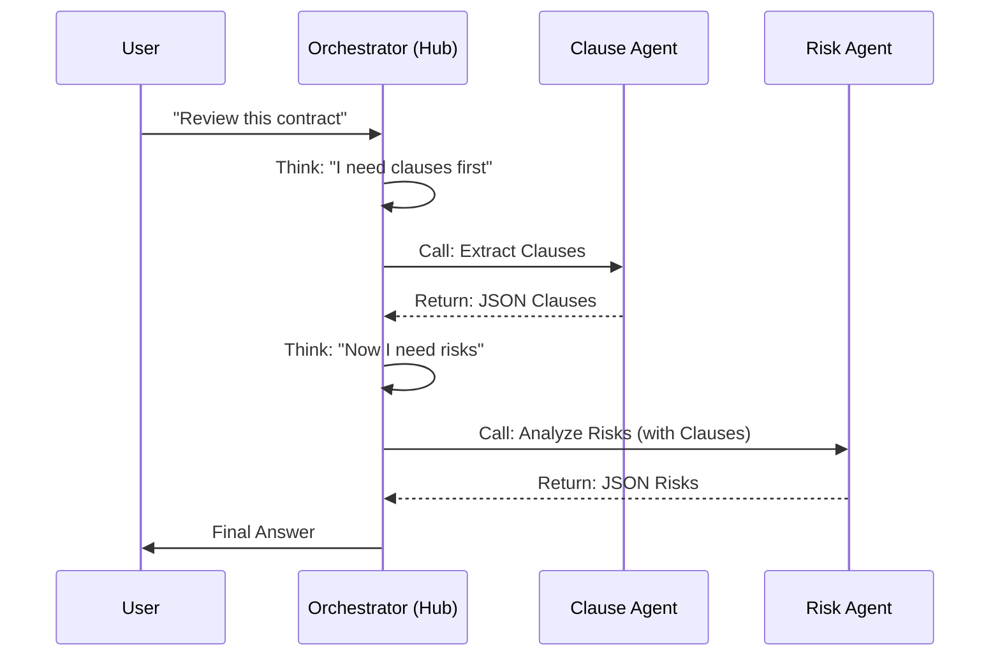
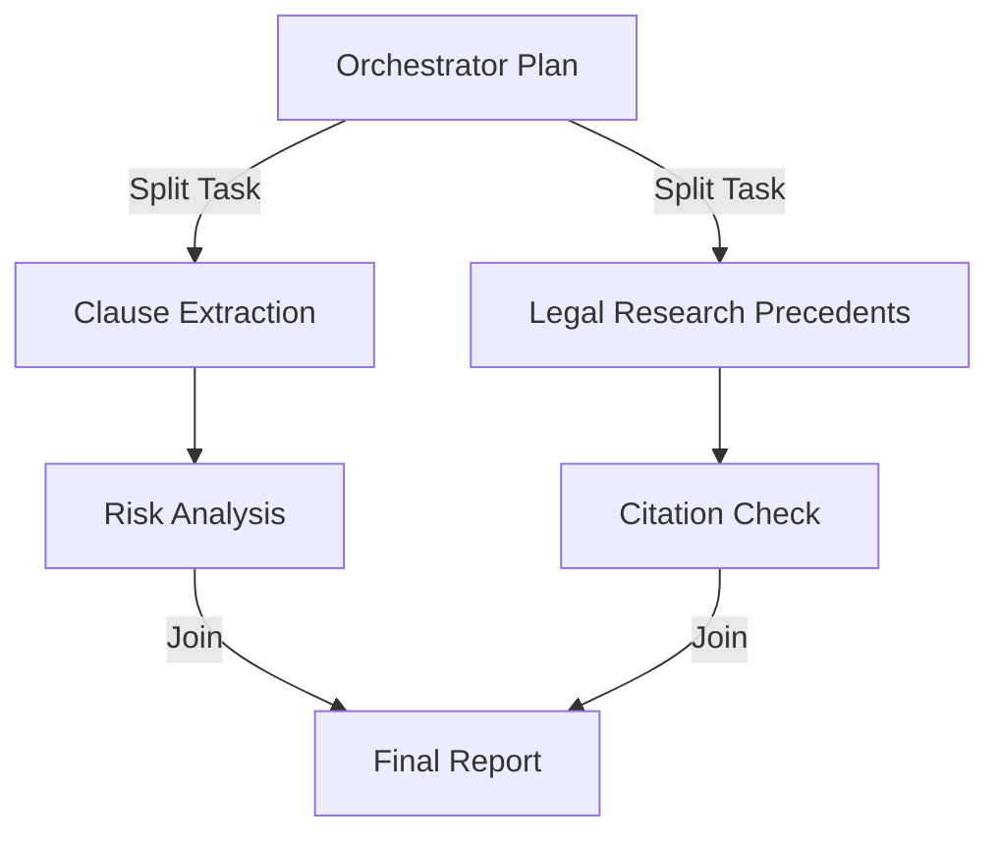
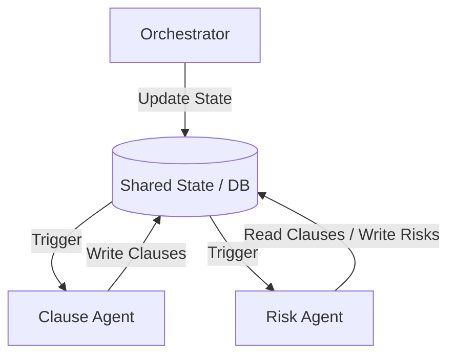

# Critical Analysis: Orchestrator vs. DAG vs. Blackboard Architecture

 You described a **"Hub-and-Spoke"** model. Here is the critical analysis of that approach and how to evolve it for your specific "Legal Agent" use case.

## 1. The Model You Described: "Hub and Spoke" (Sequential)

> "Orchestrator chooses Agent 1 -> Agent 1 returns status -> System routes to next Agent"

### Visualization


### Critical Critique
*   **✅ Pros**: 
    *   **Simple Logic**: Easy to debug. The Orchestrator is the "God Object" controlling everything.
    *   **Dynamic**: The Orchestrator can change its mind mid-execution (e.g., "Oh, Agent 1 failed, let me try Agent 1b").
*   **❌ Cons (The "Bottleneck" Problem)**:
    *   **Single Point of Failure**: If the Orchestrator hallucinates the JSON plan for step 2, the whole flow breaks.
    *   **Latency**: It is strictly sequential. You wait for A1, *then* the Orchestrator has to "think" again (another OpenAI call), *then* A2 runs.
    *   **Context Explosion**: The Orchestrator needs to read the *entire output* of Agent 1 to decide what to do next. If Agent 1 returns a 50-page extracted contract, the Orchestrator's context window fills up, costing you money and accuracy.

---

## 2. The Integrated Parallel Approach (Fan-Out / Fan-In)

You mentioned: *"parallel execution can also be integrated"*.

This is where you move from a simple chain to a **DAG (Directed Acyclic Graph)**.

### Visualization


### How to implement this?
The Orchestrator doesn't just call "Agent 1". It generates a **Batch Plan**.

**Orchestrator Output:**
```json
{
  "parallel_tasks": [
    {"agent": "clause_extractor", "input": "full_doc"},
    {"agent": "legal_researcher", "input": "check_california_validity"}
  ]
}
```

**System Executor (The "Router"):**
```python
# Pseudo-code for Parallel Execution
async def execute_plan(plan):
    # Run both at the same time
    task1 = clause_agent.run(plan[0])
    task2 = research_agent.run(plan[1])
    
    # Wait for both to finish (Fan-In)
    results = await asyncio.gather(task1, task2)
    
    # Now call the next step with combined results
    final_report = report_agent.run(results)
```

### Critical Analysis
*   **✅ Pros**: Massive speed gains. Research and Extraction happen simultaneously.
*   **❌ Cons**: Complexity. You need to handle "Race Conditions" (what if Research finishes way faster than Extraction?) and "Partial Failures" (what if Research fails but Extraction succeeds?).

---

## 3. The "Ideal" Architecture: The Shared State (Blackboard Pattern)

This is the industry-grade evolution. The Orchestrator does *not* pass data between agents. The **DB** does.

### The Concept
1.  **Orchestrator** acts as a Manager. It just sets flags in the database.
2.  **Agents** are Workers. They look at the DB, do work, and write back to the DB.

### Visualization


### Why this is better for YOUR Project
*   **User Question**: "Critically analyze my Orchestrator doubt."
*   **Answer**: In the "Hub and Spoke" model, the Orchestrator passes the *data* (the heavy JSON). In the "Shared State" model, the Orchestrator passes the *signal* ("Go run on Doc ID 123").

**Recommendation:**
Keep your Orchestrator for **High-Level Planning** (deciding *which* agents are needed), but use a **Graph/State Machine** (like LangGraph) for the actual execution, ensuring agents read/write to a shared memory (Postgres/Redis) rather than passing giant strings back and forth to the Orchestrator.
