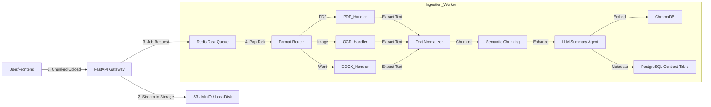

# Document Ingestion Architecture: The "Digital Clerk"

This document defines the high-performance pipeline for ingesting, validating, and processing documents (PDFs, Images, Word Docs) into the system.

## 1. High-Level Pipeline Architecture

The goal is to move from **Unstructured File** -> **Structured Knowledge** reliably.

## 2. Component Breakdown

### A. Frontend (Reception)
*   **Drag & Drop Zone**: React Dropzone.
*   **Validation**: Client-side check for magic numbers (prevent renaming `.exe` to `.pdf`).
*   **Optimization**: Use **Presigned URLs** (S3) or **Streaming Uploads** (FastAPI) to handle large files (100MB+) without crashing the server RAM.

### B. Storage Strategy (The Vault)
*   **Raw Storage**: Use an Object Store (AWS S3, Google Cloud Storage, or MinIO for local).
    *   *Naming Convention*: `uploads/{year}/{month}/{uuid}/{filename}`.
*   **Why?**: Never store user files in the Docker container or local server RAM.

### C. Processing Logic (The Brain)
We need a **Hybrid Approach** because "PDF" can mean many things.

1.  **The "Text-Native" Path**:
    *   Use `PyMuPDF` (fastest) or `pdfplumber`.
    *   *Check*: If text extraction yields garbage or < 50 chars per page, switch to OCR.
    
    2.  **The "OCR" Path (Open Source Vision)**:
    *   Use **Surya OCR** (State of the Art for layouts/tables) or **PaddleOCR**.
    *   *Why?* Surya is currently the best open-source model for preserving reading order and table structures, critical for legal contracts, without paying per-page fees.
    
    3.  **The "Intelligent Chunking"**:
    *   Don't just split by 1000 characters.
    *   **Semantic Split**: Split by "Article", "Section", or paragraphs.
    *   **RecursiveCharacterTextSplitter** (from your code) is a good start, but legal headers ("SECTION 2.1") should be used as breakpoints.

### D. Metadata Enrichment (The Value Add)
Before saving to VectorDB, we add contexts.
*   **Summary**: "This chunk discusses the Termination Clause." (Already in your `document_parser.py`).
*   **Line Numbers**: Crucial for legal. "Error in line 45".
*   **Page Numbers**: Absolute requirement for citations.

## 3. Integration with Shared State (The Blackboard)

When the Ingestion Worker finishes, it updates the **Blackboard**:

1.  **Update `Contract` Table**:
    *   `status`: `UPLOADED` -> `PROCESSING` -> `READY`.
    *   `page_count`: 15.
    *   `file_hash`: SHA256 (for de-duplication).

2.  **Update `VectorDB`**:
    *   Store chunks with `contract_id` metadata so we can filter `where contract_id == X`.

## 4. Specific Recommendations for Your Code

*   **`document_parser.py`**:
    *   **Remove** the Azure OCR integration.
    *   **Add** `surya-ocr` integration for scanned docs.
    *   **Improvement**: Add a "Hybrid Check". Run `PyMuPDF` first. If `len(text) < threshold`, *then* call Surya (on GPU/CPU).
    *   **Improvement**: The `vector_store` initialization is global. In a real app, ensure it handles concurrent writes or use the Client/Server mode of Chroma.

## 5. Failure Handling
*   **Corrupt PDF**: Mark status as `FAILED_CORRUPT`, notify user.
*   **Password Protected**: Catch `EncryptedPDFError`, ask user for password (update `Contract` status to `NEEDS_PASSWORD`).
*   **Timeouts**: OCR can take minutes. Ensure the request to Azure is async or backgrounded (Celery).
